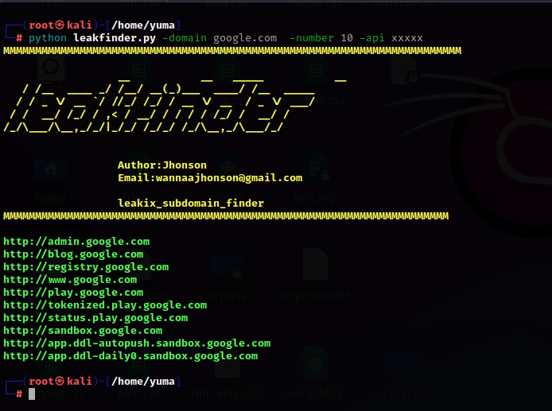

# leakfinder

# Install 
pip install -r requirements.txt

# Usage  
python3 leakfinder.py -domain exemple.com -number 10 -api xxxxxx

# Disclaimer 
Please make good use of this tool

# Poc Orgin
<!DOCTYPE html>
<html lang="en">
<head>
    <meta charset="UTF-8">
    <meta name="viewport" content="width=device-width, initial-scale=1.0">
    
  

 <code>curl -H 'accept: application/json' https://leakix.net/api/subdomains/domain.com</code>
   

</html>

